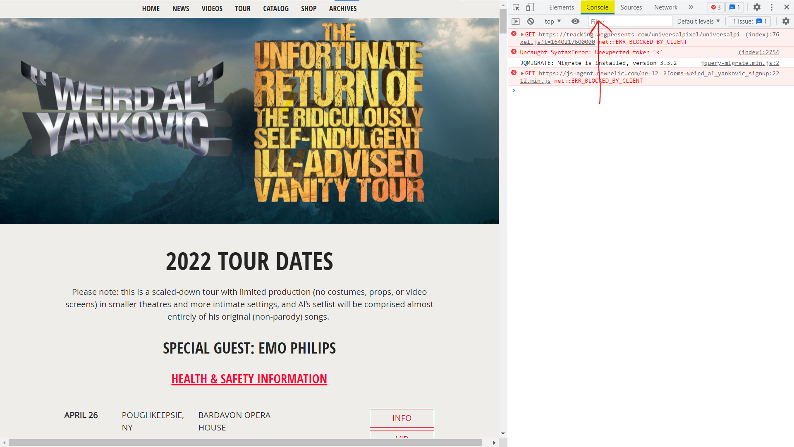
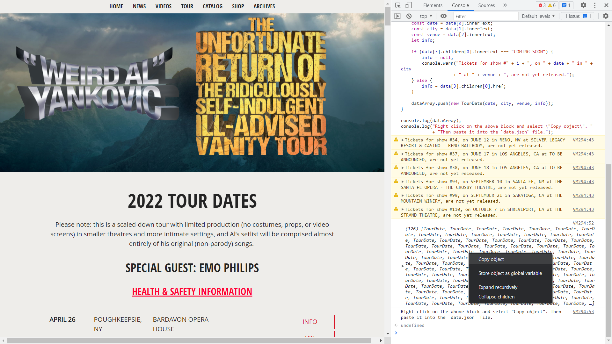
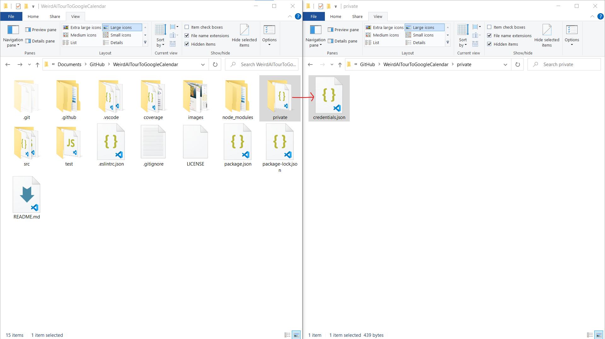
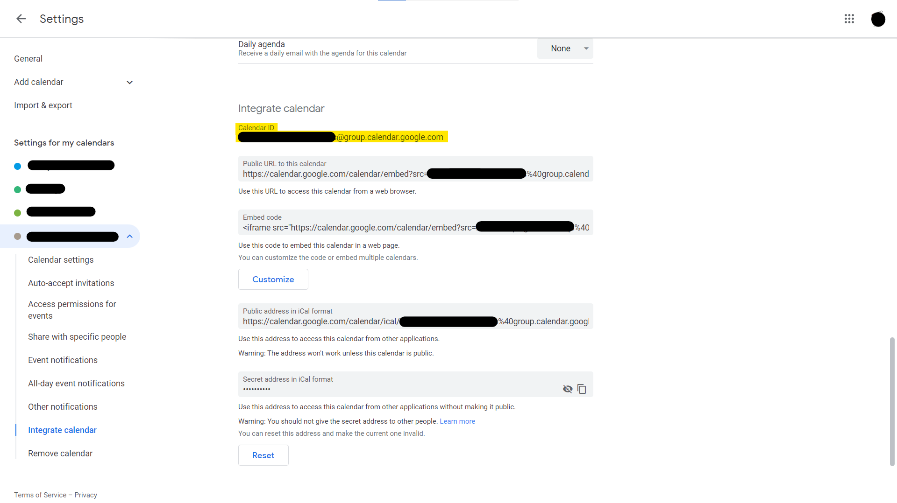

# Weird Al Tour to Google Calendar

Scripts to extract tour dates from "Weird Al" Yankovic's website and upload them
to Google Calendar.

Made for *The Unfortunate Return of the Ridiculously Self-Indulgent Ill-Advised*
*Vanity Tour* from <https://www.weirdal.com/tour/>, but adaptable to any tour as
long as the data is present.

## Usage

### Prerequisites

Before starting, make sure you have the following ready:

- [Node.js & npm][Nodejs] installed
- A Google account
- A text editor
  - An IDE capable of JS will be helpful, but is not necessary

### Downloading

1. Download the code and save it somewhere where you can find it
2. Extract the files
3. Install the dependencies with your IDE.
   If you do not have an IDE, follow these steps:
   1. Open a terminal window in the project folder
      - On Windows, you can do this by opening the folder in File Explorer,
        then holding <kbd>Shift</kbd> and right-clicking, and then selecting
        "Open PowerShell Window here" or "Open Command Prompt here"
   2. Type `npm i` and press <kbd>Enter</kbd>
      - This may take some time to complete. You can move on to 
        the next steps while this runs

### Extracting data

1. Copy everything in `src/extractData.js`
2. Open <https://www.weirdal.com/tour/> on your computer
3. Press <kbd>F12</kbd> or <kbd>Ctrl</kbd>+<kbd>Shift</kbd>+<kbd>I</kbd>
to open developer tools
4. Select the Console tab at the top

5. Paste the copied code and press <kbd>Enter</kbd>
6. You will see a large block with a number in parenthesis followed by
   a lot of `TourDate`s. Right click this and select "Copy object"
   - You may see some warnings above the block about tickets "not yet released."
     This will not affect the functionality of the script, but you'll want to
     check back later to see if they have been added yet, and if so,
     update the calendar

7. Open `src/data.json` in a file editor or IDE and paste in the data you just
   copied. Remember to save it.

### Uploading the data

#### Set up Google Calendar API

1. Follow the steps [here][GCP create] to create a Google Cloud project
   - The name of the project does not matter
2. Follow the next steps [here][GCP API] to enable the **"Google Calendar API"**
3. Follow [these][GCP creds] steps to create an **OAuth client ID** for a
   **Desktop app**
   - The app name does not matter
4. Once the client is created, click **Download JSON**
5. Navigate to the folder where downloaded this project
6. Create a new folder called `private`
7. Open the new folder and save the file as `credentials.json`

#### Upload files

1. Open [Google Calendar settings][G Cal settings]
2. Select the calendar you want to add the events to
3. Scroll to the **Integrate calendar** section and copy the **Calendar ID**.
   It will either be your email or end in `@group.calendar.google.com`

4. Open `src/uploadToGCal.js` in a file editor or IDE and set `CALENDAR_ID` to
   your calendar's ID. Make sure to keep the quotes around it and save the file
5. If you are using an IDE, run the file now. If not, follow these steps:
   1. Open a terminal window in the project folder
      - On Windows, you can do this by opening the folder in File Explorer,
        then holding <kbd>Shift</kbd> and right-clicking, and then selecting
        "Open PowerShell Window here" or "Open Command Prompt here"
   2. Type `node src/uploadToGCal.js` and press <kbd>Enter</kbd>
6. If this is your first time, open the link given and authorize the app
   Paste the code back in the terminal window and press <kbd>Enter</kbd>
   - You cannot copy and paste normally in a terminal window.
   - If you are in PowerShell, highlight the link and right-click to copy, then
     paste the code by right-clicking again
   - In most other environments, you'll need to use
     <kbd>Ctrl</kbd>+<kbd>Shift</kbd>+<kbd>C</kbd> to copy and
     <kbd>Ctrl</kbd>+<kbd>Shift</kbd>+<kbd>V</kbd> to paste in the terminal window
7. Once authorized, the program will upload all the events to your calendar.
   Due to rate limiting, it will take a minute or two to complete.
   You will know it's done when the prompt and blinking cursor return

### Updating data

Updating events will come in a future update. For now, you'll have to
clear the old events from the calendar and rerun the steps above
or update them on your calendar manually.

## License

Weird Al Tour to Google Calendar is licensed under [MIT License](LICENSE).

<!-- Links -->

[Nodejs]: https://nodejs.org/en/
[GCP create]: https://developers.google.com/workspace/guides/create-project
[GCP API]: https://developers.google.com/workspace/guides/enable-apis
[GCP creds]: https://developers.google.com/workspace/guides/create-credentials#desktop-app
[G Cal settings]: https://calendar.google.com/calendar/u/0/r/settings
